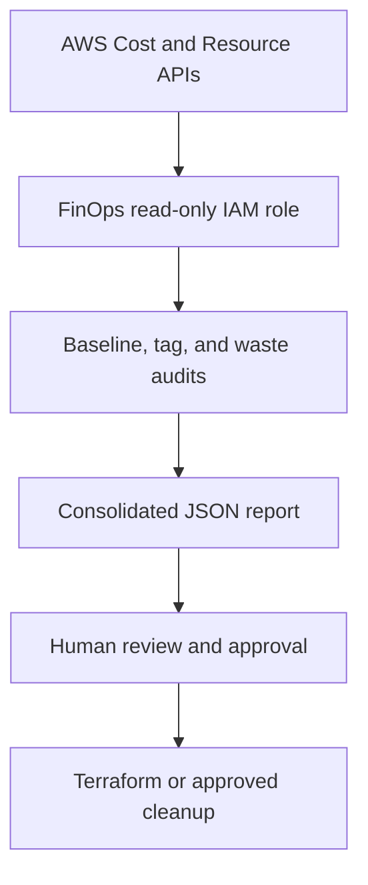

# Phase 10 — FinOps Architecture

## Purpose

This architecture provides cost visibility and optimization controls without
granting the FinOps reporting identity permission to modify infrastructure.

## High-Level Flow

## Components

### AWS Cost Explorer

Cost Explorer supplies:

- Daily unblended costs
- Cost grouped by AWS service
- EC2 Other and VPC usage-type details
- Current-month actual spend
- Daily cost forecast
- Cost anomaly findings

All date boundaries use UTC to match AWS billing APIs.

### AWS Budgets

The consolidated report retrieves the monthly budget, calculated actual spend,
forecasted spend, and notification thresholds.

Budget alerts provide visibility. They do not automatically destroy or modify
infrastructure.

For every budget notification, the reporting workflow retrieves subscriber
metadata and records only the subscriber count and delivery type. Subscriber
addresses are intentionally excluded from generated reports.

### Resource Groups Tagging API

The tag audit discovers resources associated with `Project=baba-app` and
evaluates the standard:

- `Project=baba-app`
- `Environment=dev`
- `ManagedBy=Terraform`
- `Owner=platform-engineering`
- `CostCenter=portfolio`
- `Phase=<owning phase>`

KMS keys already pending deletion are reported separately and excluded from the
active-resource compliance denominator.

The discovery query is intentionally scoped to `Project=baba-app`. This
provides deterministic Baba App reporting, but it cannot discover a resource
that is missing the `Project` tag entirely. A 100% result therefore means that
all active, taggable resources returned by the project-filtered query satisfy
the required standard; it does not represent an unfiltered inventory of every
resource in the AWS account.

The consolidated report separately queries Cost Explorer for the activation
state of the six required cost-allocation tag keys. This distinguishes
resource-level compliance from billing-level cost-allocation readiness.

### Regional Waste Inventory

The waste audit reviews:

- Stopped EC2 instances
- Unattached EBS volumes
- Self-owned snapshots older than the configured threshold
- Unassociated Elastic IPs
- Active NAT Gateways
- Application, network, and classic load balancers
- RDS database instances
- EKS clusters
- ECR repository inventory

The audit reports findings but never performs deletion.

### Consolidated Reporting

`cost-report.sh` composes the baseline, budget, anomaly, tagging, waste, ECR,
and optimization results into one JSON document.

The report is suitable for local review, evidence capture, and later CI
automation.

## IAM Architecture

The `finops-iam` Terraform module creates:

- `baba-app-dev-finops-readonly` IAM role
- `baba-app-dev-finops-readonly` customer-managed policy
- Role-policy attachment
- Trust restricted to the account's IAM Identity Center
  `AdministratorAccess` permission-set role

The policy permits only the read operations required by the reporting scripts.

## Development Runtime Lifecycle

The development runtime uses `enable_eks` as the lifecycle switch.

When enabled, Terraform creates:

- NAT Elastic IP
- NAT Gateway
- Private default route
- EKS control plane and worker resources
- Human EKS access roles and entries
- Backend workload identity resources

When disabled, those runtime resources are removed while the long-lived
foundation remains.

## Retained Foundation

The following remain available when EKS is disabled:

- VPC and subnets
- Public and private route tables
- Internet Gateway
- ECR repositories
- GitHub Actions IAM roles
- FinOps read-only role
- CloudTrail
- CloudWatch log groups
- KMS keys not tied to the disposable runtime
- Terraform remote state

## Human Approval Boundary

Discovery and reporting are automated. Infrastructure modification requires a
reviewed Terraform plan or an explicitly validated manual cleanup.

No budget or anomaly threshold directly triggers destructive action.

## Phase Boundary

Phase 10 provides governance, reporting, and cost optimization. It does not
introduce application features, replace security controls, or create automatic
remediation that bypasses human approval.
